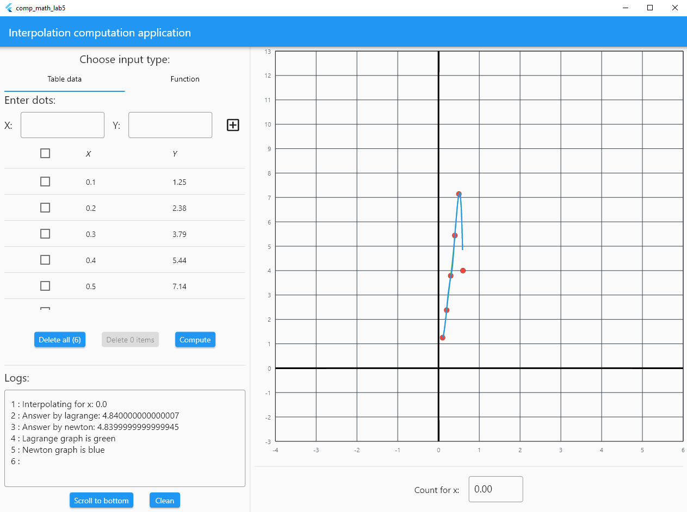
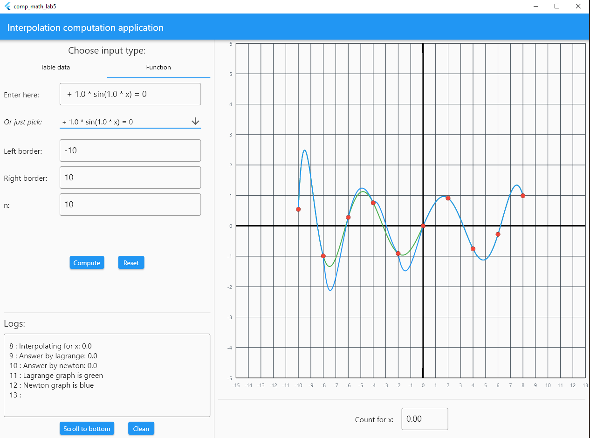

<!-- PROJECT SHIELDS -->
<!--
*** I'm using markdown "reference style" links for readability.
*** Reference links are enclosed in brackets [ ] instead of parentheses ( ).
*** See the bottom of this document for the declaration of the reference variables
*** for contributors-url, forks-url, etc. This is an optional, concise syntax you may use.
*** https://www.markdownguide.org/basic-syntax/#reference-style-links
-->
[![Contributors][contributors-shield]][contributors-url]
[![Forks][forks-shield]][forks-url]
[![Stargazers][stars-shield]][stars-url]
[![Issues][issues-shield]][issues-url]
[![MIT License][license-shield]][license-url]


<!-- PROJECT LOGO -->
<br />
<p align="center">
  <a href="https://github.com/burevestnik-png/comp-math-lab5">
    
  </a>

<h3 align="center">Computational math lab 5</h3>
</p>


<!-- TABLE OF CONTENTS -->
<details open="open">
  <summary><h2 style="display: inline-block">Table of Contents</h2></summary>
  <ol>
    <li>
      <a href="#about-the-project">About The Project</a>
      <ul>
        <li><a href="#built-with">Built With</a></li>
      </ul>
    </li>
    <li>
      <a href="#getting-started">Getting Started</a>
      <ul>
        <li><a href="#installation">Installation</a></li>
      </ul>
    </li>
    <li><a href="#usage">Usage</a></li>
    <li><a href="#roadmap">Roadmap</a></li>
    <li><a href="#contributing">Contributing</a></li>
    <li><a href="#license">License</a></li>
    <li><a href="#contact">Contact</a></li>
  </ol>
</details>


<!-- ABOUT THE PROJECT -->
## About The Project

Computational laboratory work №5 <br/>

This program can compute interpolation for every table based functions (where h  = const), 
and draw interpolation graphs. Also you can pass your own function in special textfield (supported all polynoms 
and sin functions).


### Built With

* Flutter
* GetX package
* FlCharts


<!-- GETTING STARTED -->
## Getting Started

To get a local copy up and running follow these simple steps.


### Installation

1. Clone the repo
   ```sh
   git clone https://github.com/burevestnik-png/comp-math-lab5.git
   ```
2. Install pub.dev packages
   ```sh
   flutter pub get
   ```
3. Run in root
   ```shell
    flutter run 
   ```


<!-- USAGE EXAMPLES -->
## Usage
UI samples:





_For more examples, please refer to the [Documentation](https://flutter.dev/docs)_


<!-- CONTRIBUTING -->
## Contributing

Contributions are what make the open source community such an amazing place to be learn, inspire, and create. Any contributions you make are **greatly appreciated**.

1. Fork the Project
2. Create your Feature Branch (`git checkout -b feature/AmazingFeature`)
3. Commit your Changes (`git commit -m 'Add some AmazingFeature'`)
4. Push to the Branch (`git push origin feature/AmazingFeature`)
5. Open a Pull Request


<!-- LICENSE -->
## License

Distributed under the MIT License. See `LICENSE` for more information.


<!-- CONTACT -->
## Contact

Yaroslav Kulinich - yaroslav1630@gmail.com

Project Link: [https://github.com/burevestnik-png/comp-math-lab5](https://github.com/burevestnik-png/comp-math-lab5)


<!-- MARKDOWN LINKS & IMAGES -->
<!-- https://www.markdownguide.org/basic-syntax/#reference-style-links -->
[contributors-shield]: https://img.shields.io/github/contributors/burevestnik-png/comp-math-lab5.svg?style=for-the-badge
[contributors-url]: https://github.com/burevestnik-png/comp-math-lab5/graphs/contributors
[forks-shield]: https://img.shields.io/github/forks/burevestnik-png/comp-math-lab5.svg?style=for-the-badge
[forks-url]: https://github.com/burevestnik-png/comp-math-lab5/network/members
[stars-shield]: https://img.shields.io/github/stars/burevestnik-png/comp-math-lab5.svg?style=for-the-badge
[stars-url]: https://github.com/burevestnik-png/comp-math-lab5/stargazers
[issues-shield]: https://img.shields.io/github/issues/burevestnik-png/comp-math-lab5.svg?style=for-the-badge
[issues-url]: https://github.com/burevestnik-png/comp-math-lab5/issues
[license-shield]: https://img.shields.io/github/license/burevestnik-png/comp-math-lab5.svg?style=for-the-badge
[license-url]: https://github.com/burevestnik-png/comp-math-lab5/blob/master/LICENSE.txt
